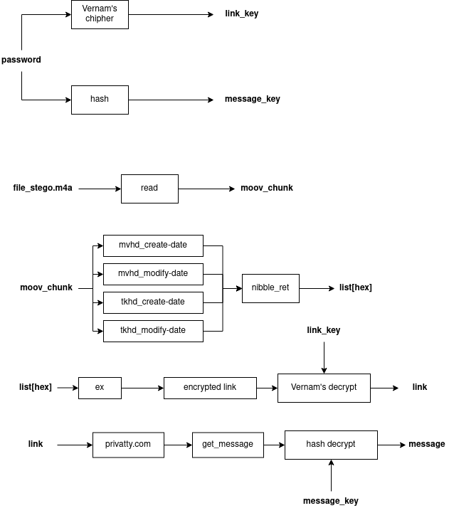
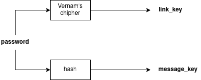
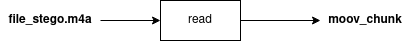
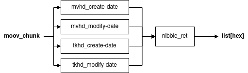
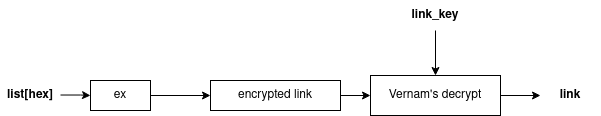
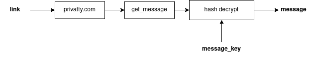

# Схема считывания сообщения с файла (read).

## Схема 1

После того как мы вводим пароль мы получаем 2 ключа. Первый, зашифрованный при помощи шифра Вернама, предназначен для расшифрования ссылки 
> link_key 

Второй в свою очередь предназначен для дешифровки сообщения.
> message_key

## Схема 2

Файл с зашифрованным сообщением мы считываем и находим в нем специальный чанк(или атом), в котором находится сообщения
> moov

## Схема 3

После считывания данного чанка мы перебираем его до подчанков, в которых и находится сообщение

> Чанк mvhd
>
>> create-date
>
>> modify-date

> Чанк tkhd 
> 
>> create-date
> 
>> modify-date

Собираем сообщение и при помощи словарей(nibble_ret) получаем список hex элементов

# Схема 4

После получения списка hex элементов мы при помощи функции ***ex*** мы переводим список hex элементов в зашифрованную ссылку. Затем при помощи **link_key** расшифровываем её и получаем готовую ссылку.

# Схема 5

После получения ссылки, мы переходим по ней на сервис одноразовых сообщений в которой считываем зашифрованное послание. При помощи **message_key** мы расшифровываем послание и читаем.

### Внимание прочитать один и тот же файл дважды невозможно. Сообщение является одноразовым.
