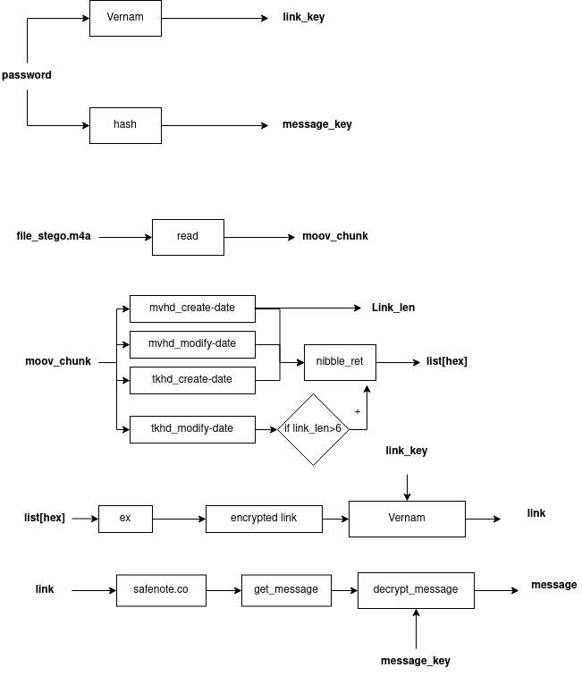
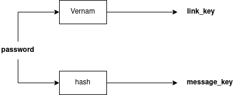
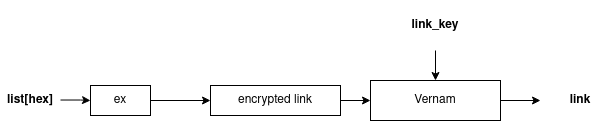
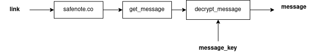

# Схема считывания сообщения с файла (read).

## Схема 1

После того как мы вводим пароль, мы используем его как два ключа. Первый ключ для расшиврования ссылки при помощи шифра вернама ***link_key***

Второй в свою очередь предназначен для дешифровки хэшированного сообщения, ***message_key***.

## Схема 2
  

Файл с зашифрованным сообщением мы считываем и находим в нем специальный чанк(или атом) ***moov***, в котором находится сообщение

## Схема 3

После считывания данного чанка мы перебираем его до подчанков, в которых и находится сообщение. В каждом чанке находится максимум по 2 символа из ссылки. Размер ссылки от 4-7, поэтому в первом подчанке первым символом мы храним размер ссылки.

- Чанк mvhd:
  - create-date - считываем первые 2 симвова и определяем размер
  - modify-date - считываем вторые 2 символа

- Чанк tkhd
    - create-date - в третьем чанке может храниться минимум 1 символ. Считываем его в любом случае
    - modify-date - в четвертом чанке может не быть символов. Чтобы корректно считать ссылку мы проверяем первый символ который является размером ссылки. В случае если цифра больше 6, тогда мы считываем символы в данном чанке, иначе его не открываем.

Собираем сообщение и при помощи словарей(***nibble_ret***) получаем список hex элементов

# Схема 4

После получения списка hex элементов мы при помощи функции ***ex*** мы переводим список hex элементов в зашифрованную ссылку. Затем при помощи **link_key** расшифровываем её и получаем готовую ссылку формата ***safenote.co/(link)***.

# Схема 5

После получения ссылки, мы переходим по ней на сервис одноразовых сообщений в которой считываем зашифрованное послание. При помощи **message_key** мы расшифровываем послание и читаем.

### Внимание прочитать один и тот же файл дважды невозможно. Сообщение является одноразовым.
